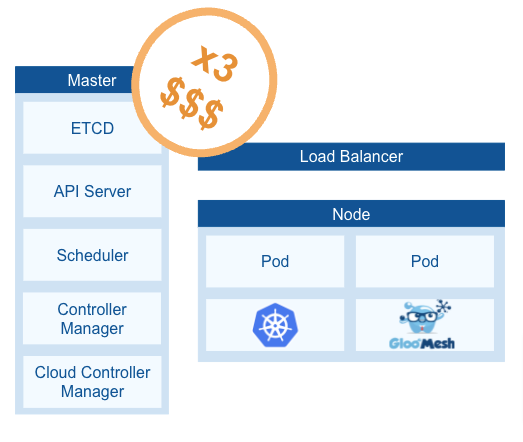
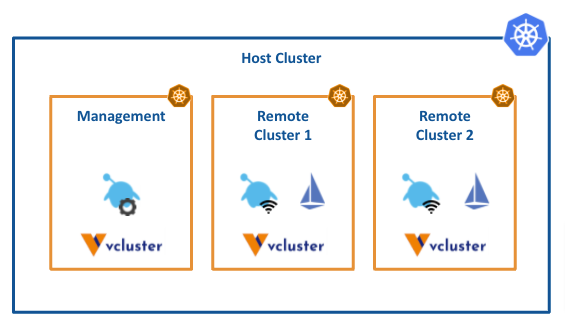
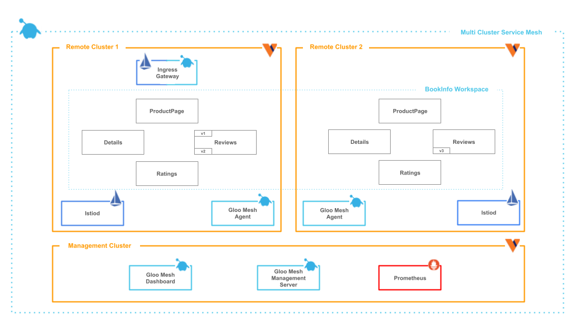

# Multi cluster Istio with Gloo Mesh and vCluster

At Solo.io we listen to the community and their needs and help on the path to meet the community and customers goals.

That drove us to create Gloo Mesh. To reduce the complexities that, as you might know, Istio has.

The intention is to make the Service Mesh easy to operate for everyone.

The challenge comes when you need to test. Gloo Mesh is a multi-cluster solution for a Service Mesh that can be installed in one cluster only (mono-cluster).

However, to test properly, you need to simulate a real scenario. Therefore, we are talking about a minimum of 3 clusters: 1 management cluster and 2 remote clusters.

A minimum setup would include 1 master node and 1 worker node per cluster.



How can you avoid this cost?

## VCluster

> A dream within a dream

I hope you saw the movie Inception. I enjoyed it a lot. From time to time I watch it again. The idea was pretty catchy: “A dream within a dream”.

The technology and most specifically, virtualization, follows the same idea. If you are familiar with Docker which is already a way of virtualization, years ago there was the need for Docker-in-docker. Nowadays it is a very common approach in your CICD tool where the tasks are running in a container but you need to, for example, test an application already embedded in another container. This would be a use case of docker-in-docker.

Given that idea, what blocks you to do Cluster-in-cluster? And here is the benefit that vcluster offers to you. Here a visualization:



In the picture we can see that Gloo Mesh, which before required 3 clusters to graduate as a production ready environment, now just needs 1 cluster with 3 vclusters.

- Cost effective

Now, your cost is only 1 cluster. It is true that it needs to be bigger than before. But it is much better than deploying 3 clusters.

- Time-saving

Besides, when you work in your local environment, you do not want to spend time creating new clusters. If you use kind (kubernetes in docker), it can take several minutes to have 3 new clusters. With vcluster, in around 20 seconds, you can enjoy new 3 clusters.

Let’s prove all this in a workshop.

## Hands on!

In this workshop, in a matter of seconds, you will deploy Gloo Mesh in 3 clusters (1 management and 2 remote ones), Istio with different versions in each cluster and a demo application you can use to probe Gloo Mesh capabilities like Multi-cluster Traffic, Traffic Splitting, Fault Injection, etc.

All this is based on 1 host kubernetes cluster containing 3 vclusters.

Your architecture will look like this:



## Pre-requisites

- A Kubernetes cluster which will be the host cluster
- [vcluster CLI](https://www.vcluster.com/docs/getting-started/setup)
- [Helm v3](https://helm.sh/docs/intro/quickstart/)
- [Kubectl](https://kubernetes.io/docs/tasks/tools/#kubectl)

## Getting Started

Let’s check how long it takes you to deploy everything.

First, let’s prepare the values for the vcluster

```
cat << EOF > /tmp/vcluster-values.yaml
isolation:
  enabled: true # (1)
  limitRange:
    enabled: false # (2)
  podSecurityStandard: privileged # (3)
  resourceQuota:
    enabled: false # (4)
rbac:
  clusterRole:
    create: true
syncer:
  extraArgs:
  - --fake-nodes=false # (5)
  - --sync-all-nodes
vcluster:
  image: rancher/k3s:v1.22.5-k3s1 # (6)
EOF
```

1. Isolation allows you to deploy different CRDs versions in the vcluster. That allows you to have two installations of Istio with different CRD versions.
2. Disable the limit restrictions
3. This makes sure that the pods can reach the node. This is only because you are testing.
4. Disable the quota restrictions
5. Re-use the real nodes of your host cluster

Create `mgmt` cluster and retrieve its kubeconfig:
```
vcluster create mgmt -n mgmt --expose -f /tmp/vcluster-values.yaml  --isolate

vcluster connect mgmt --namespace mgmt --update-current
```

Create `cluster1` (Remote cluster1) and retrieve its kubeconfig:
```
vcluster create cluster1 -n cluster1 --expose -f /tmp/vcluster-values.yaml  --isolate

vcluster connect cluster1 --namespace cluster1 --update-current
```

Create `cluster2`(Remote cluster2) and retrieve its kubeconfig:
```
vcluster create cluster2 -n cluster2 --expose -f /tmp/vcluster-values.yaml  --

vcluster connect cluster2 --namespace cluster2 --update-current
```

Obtain the host cluster context:
```
HOST_CLUSTER=$(kubectl config current-context)
```

And keep the contexts for the vcluster:
```
export MGMT=vcluster_mgmt_mgmt
export CLUSTER1=vcluster_cluster1_cluster1
export CLUSTER2=vcluster_cluster2_cluster2
```

You can also see the contexts with:
```
kubectl config get-contexts
```

Let's see what happened in your host cluster.
```
kubectl get ns --context $HOST_CLUSTER
```

And you will see the 3 namespaces which contain the 3 vclusters:
```txt
NAME              STATUS   AGE
kube-system       Active   5h55m
default           Active   5h55m
kube-public       Active   5h55m
kube-node-lease   Active   5h55m
mgmt              Active   7m
cluster1          Active   9m
cluster2          Active   8m
```

Let's see one of the other 3 vclusters:
```
kubectl get ns --context $MGMT
```

And you will see that the number of namespaces and ages are different proving that they are different clusters with different information:
```
NAME              STATUS   AGE
default           Active   14m
kube-system       Active   14m
kube-public       Active   14m
kube-node-lease   Active   14m
```

Now let's install different components in different clusters.

First, let's use `mgmt` as our reference cluster for Gloo Mesh since the host cluster is just to be used as foundation.

```
kubectl config use-context ${MGMT}
```

### Deploy Istio

Download and deploy Istio:
```
export ISTIO_VERSION=1.11.7
curl -L https://istio.io/downloadIstio | sh -
```

Create namespaces in the `Remote Cluster 1`:
```
kubectl --context ${CLUSTER1} create ns istio-system
kubectl --context ${CLUSTER1} create ns istio-gateways
```

And deploy Istio:
```
helm --kube-context=${CLUSTER1} upgrade --install istio-base ./istio-1.11.7/manifests/charts/base -n istio-system

helm --kube-context=${CLUSTER1} upgrade --install istio-1.11.7 ./istio-1.11.7/manifests/charts/istio-control/istio-discovery -n istio-system --values - <<EOF
revision: 1-11
global:
  meshID: mesh1
  multiCluster:
    clusterName: cluster1
  network: network1
meshConfig:
  trustDomain: cluster1
  accessLogFile: /dev/stdout
  enableAutoMtls: true
  defaultConfig:
    envoyMetricsService:
      address: gloo-mesh-agent.gloo-mesh:9977
    envoyAccessLogService:
      address: gloo-mesh-agent.gloo-mesh:9977
    proxyMetadata:
      ISTIO_META_DNS_CAPTURE: "true"
      ISTIO_META_DNS_AUTO_ALLOCATE: "true"
      GLOO_MESH_CLUSTER_NAME: cluster1
pilot:
  env:
    PILOT_SKIP_VALIDATE_TRUST_DOMAIN: "true"
EOF
```

Deploy the Ingress Gateway:
```
kubectl --context ${CLUSTER1} label namespace istio-gateways istio.io/rev=1-11

helm --kube-context=${CLUSTER1} upgrade --install istio-ingressgateway ./istio-1.11.7/manifests/charts/gateways/istio-ingress -n istio-gateways --values - <<EOF

gateways:
  istio-ingressgateway:
    name: istio-ingressgateway
    namespace: istio-gateways
    labels:
      istio: ingressgateway
    injectionTemplate: gateway
    ports:
    - name: http2
      port: 80
      targetPort: 8080
    - name: https
      port: 443
      targetPort: 8443
EOF

helm --kube-context=${CLUSTER1} upgrade --install istio-eastwestgateway ./istio-1.11.7/manifests/charts/gateways/istio-ingress -n istio-gateways --values - <<EOF

gateways:
  istio-ingressgateway:
    name: istio-eastwestgateway
    namespace: istio-gateways
    labels:
      istio: eastwestgateway
      topology.istio.io/network: network1
    injectionTemplate: gateway
    ports:
    - name: tcp-status-port
      port: 15021
      targetPort: 15021
    - name: tls
      port: 15443
      targetPort: 15443
    - name: tcp-istiod
      port: 15012
      targetPort: 15012
    - name: tcp-webhook
      port: 15017
      targetPort: 15017
    env:
      ISTIO_META_ROUTER_MODE: "sni-dnat"
      ISTIO_META_REQUESTED_NETWORK_VIEW: "network1"
EOF
```

Similar for `Remote Cluster 2`:
```
kubectl --context ${CLUSTER2} create ns istio-system
kubectl --context ${CLUSTER2} create ns istio-gateways
```

Istio:
```
helm --kube-context=${CLUSTER2} upgrade --install istio-base ./istio-1.11.7/manifests/charts/base -n istio-system

helm --kube-context=${CLUSTER2} upgrade --install istio-1.11.7 ./istio-1.11.7/manifests/charts/istio-control/istio-discovery -n istio-system --values - <<EOF
revision: 1-11
global:
  meshID: mesh1
  multiCluster:
    clusterName: cluster2
  network: network1
meshConfig:
  trustDomain: cluster2
  accessLogFile: /dev/stdout
  enableAutoMtls: true
  defaultConfig:
    envoyMetricsService:
      address: gloo-mesh-agent.gloo-mesh:9977
    envoyAccessLogService:
      address: gloo-mesh-agent.gloo-mesh:9977
    proxyMetadata:
      ISTIO_META_DNS_CAPTURE: "true"
      ISTIO_META_DNS_AUTO_ALLOCATE: "true"
      GLOO_MESH_CLUSTER_NAME: cluster2
pilot:
  env:
    PILOT_SKIP_VALIDATE_TRUST_DOMAIN: "true"
EOF
```

And Gateway:
```
kubectl --context ${CLUSTER2} label namespace istio-gateways istio.io/rev=1-11

helm --kube-context=${CLUSTER2} upgrade --install istio-ingressgateway ./istio-1.11.7/manifests/charts/gateways/istio-ingress -n istio-gateways --values - <<EOF

gateways:
  istio-ingressgateway:
    name: istio-ingressgateway
    namespace: istio-gateways
    labels:
      istio: ingressgateway
    injectionTemplate: gateway
    ports:
    - name: http2
      port: 80
      targetPort: 8080
    - name: https
      port: 443
      targetPort: 8443
EOF

helm --kube-context=${CLUSTER2} upgrade --install istio-eastwestgateway ./istio-1.11.7/manifests/charts/gateways/istio-ingress -n istio-gateways --values - <<EOF

gateways:
  istio-ingressgateway:
    name: istio-eastwestgateway
    namespace: istio-gateways
    labels:
      istio: eastwestgateway
      topology.istio.io/network: network1
    injectionTemplate: gateway
    ports:
    - name: tcp-status-port
      port: 15021
      targetPort: 15021
    - name: tls
      port: 15443
      targetPort: 15443
    - name: tcp-istiod
      port: 15012
      targetPort: 15012
    - name: tcp-webhook
      port: 15017
      targetPort: 15017
    env:
      ISTIO_META_ROUTER_MODE: "sni-dnat"
      ISTIO_META_REQUESTED_NETWORK_VIEW: "network1"
EOF
```

Run the following command until all the Istio Pods are ready:

```
kubectl --context ${CLUSTER1} get pods -n istio-system && kubectl --context ${CLUSTER1} get pods -n istio-gateways
```

When they are ready, you should get this output:
```
NAME                      READY   STATUS    RESTARTS   AGE
istiod-5c669bcf6f-2hn6c   1/1     Running   0          3m7s
NAME                                     READY   STATUS    RESTARTS   AGE
istio-eastwestgateway-77f79cdb47-f4r7k   1/1     Running   0          2m53s
istio-ingressgateway-744fcf4fb-5dc7q     1/1     Running   0          2m44s
```

And in `Remote Cluster 2`:
```
kubectl --context ${CLUSTER2} get pods -n istio-system && kubectl --context ${CLUSTER2} get pods -n istio-gateways
```

Set the environment variable for the service corresponding to the Istio Ingress Gateway of cluster1:
```
export ENDPOINT_HTTP_GW_CLUSTER1=$(kubectl --context ${CLUSTER1} -n istio-gateways get svc istio-ingressgateway -o jsonpath='{.status.loadBalancer.ingress[0].*}'):80
export ENDPOINT_HTTPS_GW_CLUSTER1=$(kubectl --context ${CLUSTER1} -n istio-gateways get svc istio-ingressgateway -o jsonpath='{.status.loadBalancer.ingress[0].*}'):443
export HOST_GW_CLUSTER1=$(echo ${ENDPOINT_HTTP_GW_CLUSTER1} | cut -d: -f1)
```

### Deploy the Bookinfo demo app

Let's deploy the demo application `Bookinfo` acrosss your remote clusters:

```
kubectl --context ${CLUSTER1} create ns bookinfo-frontends
kubectl --context ${CLUSTER1} create ns bookinfo-backends
bookinfo_yaml=https://raw.githubusercontent.com/istio/istio/1.11.7/samples/bookinfo/platform/kube/bookinfo.yaml
kubectl --context ${CLUSTER1} label namespace bookinfo-frontends istio.io/rev=1-11
kubectl --context ${CLUSTER1} label namespace bookinfo-backends istio.io/rev=1-11
# deploy the frontend bookinfo service in the bookinfo-frontends namespace
kubectl --context ${CLUSTER1} -n bookinfo-frontends apply -f ${bookinfo_yaml} -l 'account in (productpage)'
kubectl --context ${CLUSTER1} -n bookinfo-frontends apply -f ${bookinfo_yaml} -l 'app in (productpage)'
# deploy the backend bookinfo services in the bookinfo-backends namespace for all versions less than v3
kubectl --context ${CLUSTER1} -n bookinfo-backends apply -f ${bookinfo_yaml} -l 'account in (reviews,ratings,details)'
kubectl --context ${CLUSTER1} -n bookinfo-backends apply -f ${bookinfo_yaml} -l 'app in (reviews,ratings,details),version notin (v3)'
# Update the productpage deployment to set the environment variables to define where the backend services are running
kubectl --context ${CLUSTER1} -n bookinfo-frontends set env deploy/productpage-v1 DETAILS_HOSTNAME=details.bookinfo-backends.svc.cluster.local
kubectl --context ${CLUSTER1} -n bookinfo-frontends set env deploy/productpage-v1 REVIEWS_HOSTNAME=reviews.bookinfo-backends.svc.cluster.local


kubectl --context ${CLUSTER2} create ns bookinfo-frontends
kubectl --context ${CLUSTER2} create ns bookinfo-backends
bookinfo_yaml=https://raw.githubusercontent.com/istio/istio/1.11.7/samples/bookinfo/platform/kube/bookinfo.yaml
kubectl --context ${CLUSTER2} label namespace bookinfo-frontends istio.io/rev=1-11
kubectl --context ${CLUSTER2} label namespace bookinfo-backends istio.io/rev=1-11
# deploy the frontend bookinfo service in the bookinfo-frontends namespace
kubectl --context ${CLUSTER2} -n bookinfo-frontends apply -f ${bookinfo_yaml} -l 'account in (productpage)'
kubectl --context ${CLUSTER2} -n bookinfo-frontends apply -f ${bookinfo_yaml} -l 'app in (productpage)'
# deploy the backend bookinfo services in the bookinfo-backends namespace for all versions
kubectl --context ${CLUSTER2} -n bookinfo-backends apply -f ${bookinfo_yaml} -l 'account in (reviews,ratings,details)'
kubectl --context ${CLUSTER2} -n bookinfo-backends apply -f ${bookinfo_yaml} -l 'app in (reviews,ratings,details)'
# Update the productpage deployment to set the environment variables to define where the backend services are running
kubectl --context ${CLUSTER2} -n bookinfo-frontends set env deploy/productpage-v1 DETAILS_HOSTNAME=details.bookinfo-backends.svc.cluster.local
kubectl --context ${CLUSTER2} -n bookinfo-frontends set env deploy/productpage-v1 REVIEWS_HOSTNAME=reviews.bookinfo-backends.svc.cluster.local
```

## Deploy and register Gloo Mesh

Run the following commands to deploy the Gloo Mesh management plane:

> Note: Contact us in order to supply with a trial key that you will use in this step

```
helm repo add gloo-mesh-enterprise https://storage.googleapis.com/gloo-mesh-enterprise/gloo-mesh-enterprise 
helm repo update
kubectl --context ${MGMT} create ns gloo-mesh 
helm upgrade --install gloo-mesh-enterprise gloo-mesh-enterprise/gloo-mesh-enterprise \
--namespace gloo-mesh --kube-context ${MGMT} \
--version=2.0.0-beta19 \
--set glooMeshMgmtServer.ports.healthcheck=8091 \
--set glooMeshUi.serviceType=LoadBalancer \
--set mgmtClusterName=${MGMT} \
--set licenseKey=${GLOO_MESH_LICENSE_KEY}
kubectl --context ${MGMT} -n gloo-mesh rollout status deploy/gloo-mesh-mgmt-server
```

```
export ENDPOINT_GLOO_MESH=$(kubectl --context ${MGMT} -n gloo-mesh get svc gloo-mesh-mgmt-server -o jsonpath='{.status.loadBalancer.ingress[0].*}'):9900
export HOST_GLOO_MESH=$(echo ${ENDPOINT_GLOO_MESH} | cut -d: -f1)
```