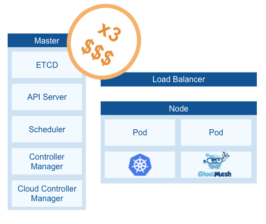

# Multi cluster Istio with Gloo Mesh and vCluster

At Solo.io we listen to the community and their needs and help on the path to meet the community and customers goals.

That drove us to create Gloo Mesh. To reduce the complexities that, as you might know, Istio has.

The intention is to make the Service Mesh easy to operate for everyone.

The challenge comes when you need to test. Gloo Mesh is a multi-cluster solution for a Service Mesh that can be installed in one cluster only (mono-cluster).

However, to test properly, you need to simulate a real scenario. Therefore, we are talking about a minimum of 3 clusters: 1 management cluster and 2 remote clusters.

A minimum setup would include 1 master node and 1 worker node per cluster.



How can you avoid this cost?

## VCluster

> A dream within a dream

I hope you saw the movie Inception. I enjoyed it a lot. From time to time I watch it again. The idea was pretty catchy: “A dream within a dream”.

The technology and most specifically, virtualization, follows the same idea. If you are familiar with Docker which is already a way of virtualization, years ago there was the need for Docker-in-docker. Nowadays it is a very common approach in your CICD tool where the tasks are running in a container but you need to, for example, test an application already embedded in another container. This would be a use case of docker-in-docker.

Given that idea, what blocks you to do Cluster-in-cluster? And here is the benefit that vcluster offers to you. Here a visualization:


In the picture we can see that Gloo Mesh, which before required 3 clusters to graduate as a production ready environment, now just needs 1 cluster with 3 vclusters.

- Cost effective

Now, your cost is only 1 cluster. It is true that it needs to be bigger than before. But it is much better than deploying 3 clusters.

- Time-saving

Besides, when you work in your local environment, you do not want to spend time creating new clusters. If you use kind (kubernetes in docker), it can take several minutes to have 3 new clusters. With vcluster, in around 20 seconds, you can enjoy new 3 clusters.

Let’s prove all this in a workshop.

## Hands on!

In this workshop, in a matter of seconds, you will deploy Gloo Mesh in 3 clusters (1 management and 2 remote ones), Istio with different versions in each cluster and a demo application you can use to probe Gloo Mesh capabilities like Multi-cluster Traffic, Traffic Splitting, Fault Injection, etc.

All this is based on 1 host kubernetes cluster containing 3 vclusters.

Your architecture will look like this:


## Pre-requisites

- A Kubernetes cluster which will be the host cluster
- [vcluster CLI](https://www.vcluster.com/docs/getting-started/setup)
- [Helm v3](https://helm.sh/docs/intro/quickstart/)
- [Kubectl](https://kubernetes.io/docs/tasks/tools/#kubectl)
- [meshctl](https://docs.solo.io/gloo-mesh-enterprise/main/setup/meshctl_cli_install/)

## Getting Started

Let’s check how long it takes you to deploy everything.

First, let’s prepare the values for the vcluster

```
cat << EOF > /tmp/vcluster-values.yaml
isolation:
  enabled: true # (1)
  limitRange:
    enabled: false # (2)
  podSecurityStandard: privileged # (3)
  resourceQuota:
    enabled: false # (4)
rbac:
  clusterRole:
    create: true
syncer:
  extraArgs:
  - --fake-nodes=false # (5)
  - --sync-all-nodes
vcluster:
  image: rancher/k3s:v1.22.5-k3s1 # (6)
EOF
```

1. Isolation allows you to deploy different CRDs versions in the vcluster. That allows you to have two installations of Istio with different CRD versions.
2. Disable the limit restrictions
3. This makes sure that the pods can reach the node. This is only because you are testing.
4. Disable the quota restrictions
5. Re-use the real nodes of your host cluster

Create `mgmt` cluster and retrieve its kubeconfig:
```
vcluster create mgmt -n mgmt --expose -f /tmp/vcluster-values.yaml  --isolate

vcluster connect mgmt --namespace mgmt --update-current
```

Create `cluster1` (Remote cluster1) and retrieve its kubeconfig:
```
vcluster create cluster1 -n cluster1 --expose -f /tmp/vcluster-values.yaml  --isolate

vcluster connect cluster1 --namespace cluster1 --update-current
```

Create `cluster2`(Remote cluster2) and retrieve its kubeconfig:
```
vcluster create cluster2 -n cluster2 --expose -f /tmp/vcluster-values.yaml  --

vcluster connect cluster2 --namespace cluster2 --update-current
```

Obtain the host cluster context:
```
HOST_CLUSTER=$(kubectl config current-context)
```

And keep the contexts for the vcluster:
```
export MGMT_CLUSTER=vcluster_mgmt_mgmt
export REMOTE_CLUSTER1=vcluster_cluster1_cluster1
export REMOTE_CLUSTER2=vcluster_cluster2_cluster2
```

You can also see the contexts with:
```
kubectl config get-contexts
```

Let's see what happened in your host cluster.
```
kubectl get ns --context $HOST_CLUSTER
```

And you will see the 3 namespaces which contain the 3 vclusters:
```txt
NAME              STATUS   AGE
kube-system       Active   5h55m
default           Active   5h55m
kube-public       Active   5h55m
kube-node-lease   Active   5h55m
mgmt              Active   7m
cluster1          Active   9m
cluster2          Active   8m
```

Let's see one of the other 3 vclusters:
```
kubectl get ns --context $REMOTE_CLUSTER2
```

And you will see that the number of namespaces and ages are different proving that they are different clusters with different information:
```txt
NAME              STATUS   AGE
default           Active   14m
kube-system       Active   14m
kube-public       Active   14m
kube-node-lease   Active   14m
```

> Note: Contact us in order to supply with a trial key that you will use in this step

export GLOO_MESH_LICENSE_KEY=<license_key>


### Install Gloo Mesh Enterprise in the management cluster

Note that this guide uses `meshctl` to install a minimum deployment of Gloo Mesh Enterprise for testing purposes, and some optional components are not installed. To learn more about these installation options see our [workshop](https://workshops.solo.io/gloo-workshops/gloo-mesh-2-0).

Set the Gloo Mesh Enterprise version to install
```
export GLOO_MESH_VERSION=2.0.0-beta20
```

Install Gloo Mesh Enterprise in your management cluster
```
meshctl install --kubecontext $MGMT_CONTEXT --license $GLOO_MESH_LICENSE_KEY --set insecure=true --version $GLOO_MESH_VERSION
```

Verify that the management components
```
kubectl get pods -n gloo-mesh --context $MGMT_CONTEXT
```

And you will see:
```txt
NAME                                     READY   STATUS    RESTARTS   AGE
gloo-mesh-mgmt-server-778d45c7b5-5d9nh   1/1     Running   0          41s
gloo-mesh-redis-844dc4f9-jnb4j           1/1     Running   0          41s
gloo-mesh-ui-749dc7875c-4z77k            3/3     Running   0          41s
prometheus-server-86854b778-r6r52        2/2     Running   0          41s
```

### Register workload clusters

In the management cluster, find the external address that was assigned by your cloud provider to the `gloo-mesh-mgmt-server` LoadBalancer service:


```
MGMT_SERVER_NETWORKING_DOMAIN=$(kubectl get svc -n gloo-mesh gloo-mesh-mgmt-server --context $MGMT_CONTEXT -o jsonpath='{.status.loadBalancer.ingress[0].ip}')
MGMT_SERVER_NETWORKING_PORT=$(kubectl -n gloo-mesh get service gloo-mesh-mgmt-server --context $MGMT_CONTEXT -o jsonpath='{.spec.ports[?(@.name=="grpc")].port}')
MGMT_SERVER_NETWORKING_ADDRESS=${MGMT_SERVER_NETWORKING_DOMAIN}:${MGMT_SERVER_NETWORKING_PORT}
echo $MGMT_SERVER_NETWORKING_ADDRESS
```

Register `cluster-1`:

```
meshctl cluster register \
  --kubecontext=$MGMT_CONTEXT \
  --remote-context=$REMOTE_CONTEXT1 \
  --relay-server-address $MGMT_SERVER_NETWORKING_ADDRESS \
  --version $GLOO_MESH_VERSION \
  $REMOTE_CLUSTER1
```

Register `cluster-2`:

```
meshctl cluster register \
  --kubecontext=$MGMT_CONTEXT \
  --remote-context=$REMOTE_CONTEXT2 \
  --relay-server-address $MGMT_SERVER_NETWORKING_ADDRESS \
  --version $GLOO_MESH_VERSION \
  $REMOTE_CLUSTER2
```

Verify that each workload cluster is successfully registered with Gloo Mesh.

```
kubectl get kubernetescluster -n gloo-mesh --context $MGMT_CONTEXT
```

Example output:
```txt
NAME           AGE
cluster-1      27s
cluster-2      23s
```

### Install Istio in the workload clusters

Set the Istio version:
```
export ISTIO_VERSION=1.11.7
```

Install Istio in `cluster-1`
```
CLUSTER_NAME=$REMOTE_CLUSTER1
cat << EOF | istioctl install -y --context $REMOTE_CONTEXT1 -f -
apiVersion: install.istio.io/v1alpha1
kind: IstioOperator
metadata:
  name: gloo-mesh-istio
  namespace: istio-system
spec:
  # only the control plane components are installed (https://istio.io/latest/docs/setup/additional-setup/config-profiles/)
  profile: minimal
  # Solo.io Istio distribution repository
  hub: $REPO
  # Solo.io Gloo Mesh Istio tag
  tag: ${ISTIO_VERSION}-solo

  meshConfig:
    # enable access logging to standard output
    accessLogFile: /dev/stdout

    defaultConfig:
      # wait for the istio-proxy to start before application pods
      holdApplicationUntilProxyStarts: true
      # enable Gloo Mesh metrics service (required for Gloo Mesh UI)
      envoyMetricsService:
        address: gloo-mesh-agent.gloo-mesh:9977
       # enable GlooMesh accesslog service (required for Gloo Mesh Access Logging)
      envoyAccessLogService:
        address: gloo-mesh-agent.gloo-mesh:9977
      proxyMetadata:
        # Enable Istio agent to handle DNS requests for known hosts
        # Unknown hosts will automatically be resolved using upstream dns servers in resolv.conf
        # (for proxy-dns)
        ISTIO_META_DNS_CAPTURE: "true"
        # Enable automatic address allocation (for proxy-dns)
        ISTIO_META_DNS_AUTO_ALLOCATE: "true"
        # Used for gloo mesh metrics aggregation
        # should match trustDomain (required for Gloo Mesh UI)
        GLOO_MESH_CLUSTER_NAME: ${CLUSTER_NAME}

    # Set the default behavior of the sidecar for handling outbound traffic from the application.
    outboundTrafficPolicy:
      mode: ALLOW_ANY
    # The trust domain corresponds to the trust root of a system. 
    # For Gloo Mesh this should be the name of the cluster that cooresponds with the CA certificate CommonName identity
    trustDomain: ${CLUSTER_NAME}
  components:
    ingressGateways:
    # enable the default ingress gateway
    - name: istio-ingressgateway
      enabled: true
      k8s:
        service:
          type: LoadBalancer
          ports:
            # health check port (required to be first for aws elbs)
            - name: status-port
              port: 15021
              targetPort: 15021
            # main http ingress port
            - port: 80
              targetPort: 8080
              name: http2
            # main https ingress port
            - port: 443
              targetPort: 8443
              name: https
            # Port for gloo-mesh multi-cluster mTLS passthrough (Required for Gloo Mesh east/west routing)
            - port: 15443
              targetPort: 15443
              # Gloo Mesh looks for this default name 'tls' on an ingress gateway
              name: tls
    - name: istio-eastwestgateway
      enabled: true
      label:
        istio: eastwestgateway
      k8s:
        env:
          # Required by Gloo Mesh for east/west routing
          - name: ISTIO_META_ROUTER_MODE
            value: "sni-dnat"
        service:
          type: LoadBalancer
          selector:
            istio: eastwestgateway
          # Default ports
          ports:
            # Health check port. For AWS ELBs, this port must be listed first.
            - name: status-port
              port: 15021
              targetPort: 15021
            # Port for multicluster mTLS passthrough; required for Gloo Mesh east/west routing
            - port: 15443
              targetPort: 15443
              # Gloo Mesh looks for this default name 'tls' on a gateway
              name: tls
    pilot:
      k8s:
        env:
         # Allow multiple trust domains (Required for Gloo Mesh east/west routing)
          - name: PILOT_SKIP_VALIDATE_TRUST_DOMAIN
            value: "true"
  values:
    # https://istio.io/v1.5/docs/reference/config/installation-options/#global-options
    global:
      # needed for connecting VirtualMachines to the mesh
      network: ${CLUSTER_NAME}
      # needed for annotating istio metrics with cluster (should match trust domain and GLOO_MESH_CLUSTER_NAME)
      multiCluster:
        clusterName: ${CLUSTER_NAME}
EOF
```

Example output:
```
✔ Istio core installed
✔ Istiod installed
✔ Ingress gateways installed
✔ Installation complete
```

Install Istio in cluster-2.
```
CLUSTER_NAME=$REMOTE_CLUSTER2
cat << EOF | istioctl install -y --context $REMOTE_CONTEXT2 -f -
apiVersion: install.istio.io/v1alpha1
kind: IstioOperator
metadata:
  name: gloo-mesh-istio
  namespace: istio-system
spec:
  # only the control plane components are installed (https://istio.io/latest/docs/setup/additional-setup/config-profiles/)
  profile: minimal
  # Solo.io Istio distribution repository
  hub: $REPO
  # Solo.io Gloo Mesh Istio tag
  tag: ${ISTIO_VERSION}-solo

  meshConfig:
    # enable access logging to standard output
    accessLogFile: /dev/stdout

    defaultConfig:
      # wait for the istio-proxy to start before application pods
      holdApplicationUntilProxyStarts: true
      # enable Gloo Mesh metrics service (required for Gloo Mesh UI)
      envoyMetricsService:
        address: gloo-mesh-agent.gloo-mesh:9977
       # enable GlooMesh accesslog service (required for Gloo Mesh Access Logging)
      envoyAccessLogService:
        address: gloo-mesh-agent.gloo-mesh:9977
      proxyMetadata:
        # Enable Istio agent to handle DNS requests for known hosts
        # Unknown hosts will automatically be resolved using upstream dns servers in resolv.conf
        # (for proxy-dns)
        ISTIO_META_DNS_CAPTURE: "true"
        # Enable automatic address allocation (for proxy-dns)
        ISTIO_META_DNS_AUTO_ALLOCATE: "true"
        # Used for gloo mesh metrics aggregation
        # should match trustDomain (required for Gloo Mesh UI)
        GLOO_MESH_CLUSTER_NAME: ${CLUSTER_NAME}

    # Set the default behavior of the sidecar for handling outbound traffic from the application.
    outboundTrafficPolicy:
      mode: ALLOW_ANY
    # The trust domain corresponds to the trust root of a system. 
    # For Gloo Mesh this should be the name of the cluster that cooresponds with the CA certificate CommonName identity
    trustDomain: ${CLUSTER_NAME}
  components:
    ingressGateways:
    # enable the default ingress gateway
    - name: istio-ingressgateway
      enabled: true
      k8s:
        service:
          type: LoadBalancer
          ports:
            # health check port (required to be first for aws elbs)
            - name: status-port
              port: 15021
              targetPort: 15021
            # main http ingress port
            - port: 80
              targetPort: 8080
              name: http2
            # main https ingress port
            - port: 443
              targetPort: 8443
              name: https
            # Port for gloo-mesh multi-cluster mTLS passthrough (Required for Gloo Mesh east/west routing)
            - port: 15443
              targetPort: 15443
              # Gloo Mesh looks for this default name 'tls' on an ingress gateway
              name: tls
    - name: istio-eastwestgateway
      enabled: true
      label:
        istio: eastwestgateway
      k8s:
        env:
          # Required by Gloo Mesh for east/west routing
          - name: ISTIO_META_ROUTER_MODE
            value: "sni-dnat"
        service:
          type: LoadBalancer
          selector:
            istio: eastwestgateway
          # Default ports
          ports:
            # Health check port. For AWS ELBs, this port must be listed first.
            - name: status-port
              port: 15021
              targetPort: 15021
            # Port for multicluster mTLS passthrough; required for Gloo Mesh east/west routing
            - port: 15443
              targetPort: 15443
              # Gloo Mesh looks for this default name 'tls' on a gateway
              name: tls
    pilot:
      k8s:
        env:
         # Allow multiple trust domains (Required for Gloo Mesh east/west routing)
          - name: PILOT_SKIP_VALIDATE_TRUST_DOMAIN
            value: "true"
  values:
    # https://istio.io/v1.5/docs/reference/config/installation-options/#global-options
    global:
      # needed for connecting VirtualMachines to the mesh
      network: ${CLUSTER_NAME}
      # needed for annotating istio metrics with cluster (should match trust domain and GLOO_MESH_CLUSTER_NAME)
      multiCluster:
        clusterName: ${CLUSTER_NAME}
EOF
```

Verify that Gloo Mesh successfully discovered the Istio service meshes in each workload cluster.

```
kubectl get mesh -n gloo-mesh --context $REMOTE_CONTEXT1
kubectl get mesh -n gloo-mesh --context $REMOTE_CONTEXT2

```

Example output:
```
NAME                            AGE
istiod-istio-system-cluster-1   68s
istiod-istio-system-cluster-2   28s

```


### Create workspaces for your workloads

Workspace is an abstraction layer we, at solo.io, have created to make it simple to understand. After the years and talks to the community, we found out that part of the complexity of Istio is to understand its abstractions.

With the idea of workspaces, we try to reduce the complexity and to offer a comprehensive API which can be understood by anyone.

Create the bookinfo namespace in each workload cluster.

```
kubectl create ns bookinfo --context $REMOTE_CONTEXT1
kubectl create ns bookinfo --context $REMOTE_CONTEXT2

```

Create a bookinfo workspace that spans across both cluster-1 and cluster-2
```
kubectl apply --context $MGMT_CONTEXT -f- <<EOF
apiVersion: admin.gloo.solo.io/v2
kind: Workspace
metadata:
  name: bookinfo
  namespace: gloo-mesh
spec:
  workloadClusters:
    - name: ${REMOTE_CLUSTER1}
      namespaces:
      - name: bookinfo
    - name: ${REMOTE_CLUSTER2}
      namespaces:
      - name: bookinfo
EOF

```

Create an istio-system workspace that spans across both cluster-1 and cluster-2

```
kubectl apply --context $MGMT_CONTEXT -f- <<EOF
apiVersion: admin.gloo.solo.io/v2
kind: Workspace
metadata:
  name: istio-system
  namespace: gloo-mesh
spec:
  workloadClusters:
    - name: ${REMOTE_CLUSTER1}
      namespaces:
      - name: istio-system
    - name: ${REMOTE_CLUSTER2}
      namespaces:
      - name: istio-system
EOF

```

Workspace can be consider like isolated areas for your teams. You can configure them as follows:

```
kubectl apply --context $REMOTE_CONTEXT1 -f- <<EOF
apiVersion: admin.gloo.solo.io/v2
kind: WorkspaceSettings
metadata:
  name: bookinfo-settings
  namespace: bookinfo
spec:
  exportTo:
     - name: 'istio-system'
  options:
    serviceIsolation:
      enabled: true
    federation:
      enabled: true
      serviceSelector:
        - {}
      hostSuffix: 'global'
EOF

kubectl apply --context $REMOTE_CONTEXT1 -f- <<EOF
apiVersion: admin.gloo.solo.io/v2
kind: WorkspaceSettings
metadata:
  name: istio-system-settings
  namespace: istio-system
spec:
  imports:
     - name: bookinfo
EOF


```

